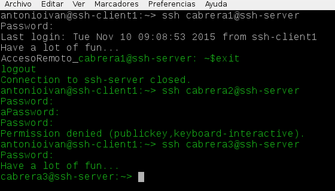
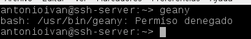
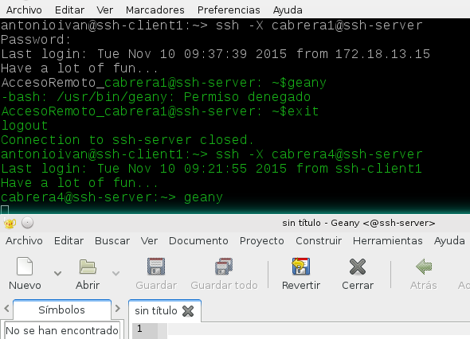

# Acceso remoto SSH

En primer lugar, preparamos todas las máquinas según las indicaciones del profesor: servidor, cliente1 y cliente2.

Algunos datos de la configuración del servidor:

ip a


route -n


host www.google.es


lsblk


blkid


* Antes de comenzar, creamos en el servidor los siguientes usuarios en ssh-server:
    * cabrera1
    * cabrera2
    * cabrera3
    * cabrera4

* Desde el servidor, reiniciamos y verificamos que el servicio está en ejecución.


##2. Primera conexión SSH desde cliente

* Desde el **ssh-client1** nos conectamos mediante `ssh cabrera1@ssh-server`. 


## ¿Y si cambiamos las claves del servidor?

* Modificar el fichero de configuración SSH (`/etc/ssh/sshd_config`) para dejar una única línea: 
`HostKey /etc/ssh/ssh_host_rsa_key`. Comentar el resto de líneas con configuración HostKey.
Este parámetro define los ficheros de clave publica/privada que van a identificar a nuestro
servidor. Con este cambio decimos que sólo vamos a usar las claves del tipo RSA.
* Generar nuevas claves de equipo en **ssh-server**. Como usuario root ejecutamos: 
`ssh-keygen -t rsa -f /etc/ssh/ssh_host_rsa_key`. 


Estamos cambiando o volviendo a generar nuevas claves públicas/privadas para la identificación de nuestro servidor.
* Reiniciar el servicio SSH: `systemctl restart sshd`.
* Comprobar que el servicio está en ejecución correctamente: `systemctl status sshd`
* Comprobar qué sucede al volver a conectarnos desde los dos clientes, usando los 
usuarios cabrera2 y cabrera1. ¿Qué sucede?

Falla con ambos usuarios porque cree que se trata de un ataque de "man in the middle":

con cabrera1


con cabrera2


#3. Personalización del prompt Bash

Añadimos en el servidor las siguientes líneas al fichero de configuración 
del usuario1 en la máquina servidor (Fichero /home/cabrera1/.bashrc)

```
#Cambia el prompt al conectarse vía SSH

if [ -n "$SSH_CLIENT" ]; then
  PS1="AccesoRemoto_\e[32;40m\u@\h: \w\a\$"
else
  PS1="\[$(ppwd)\]\u@\h:\w>"
fi
```
* Además, crear el fichero `/home/1er-apellido-alumno1/.alias` con el siguiente contenido:
```
alias c='clear'
alias g='geany'
alias p='ping'
alias v='vdir -cFl'
alias s='ssh'
```
#4. Autenticación mediante claves públicas

Ahora vamos a configurar SSH para poder acceder desde el cliente1,
usando el usuario cabrera4 sin poner password, pero usando claves pública/privada.

Vamos a configurar la autenticación mediante clave pública para acceder con 
nuestro usuario personal desde el equipo cliente al servidor con el 
usuario cabrera4.

* Iniciamos sesión con nuestro usuario *antonioivan* de la máquina ssh-client1.


* Ejecutamos `ssh-keygen -t rsa` para generar un nuevo par de claves para el 
usuario en `/home/antonioivan/.ssh/id_rsa` y `/home/antonioivan/.ssh/id_rsa.pub`.


* Ahora vamos a copiar la clave pública (id_rsa.pub) del usuario antonioivan de la máquina cliente, 
al fichero "authorized_keys" del usuario cabrera4 en el servidor.

Usamos el comando `ssh-copy-id cabrera4@ssh-server`


* Comprobamos que ahora podremos acceder remotamente, sin escribir el password desde el cliente1.


* Comprobamos que al acceder desde cliente2, si nos pide el password.


#5. Uso de SSH como túnel para X

* Instalamos en el servidor una aplicación de entorno gráfico (APP1) que no esté en los clientes. 
En este caso usamos Geany. Consultamos fichero de configuración `/etc/ssh/sshd_config` (Opción `X11Forwarding yes`). Por defecto viene descomentada la línea `X11Forwarding yes` así que no tendremos que hacer nada con el archivo `/etc/ssh/sshd_config`.


* Comprobamos el funcionamiento de APP1 desde cliente1.
	
    Usamos el comando `ssh -X cabrera1@ssh-server`
    


#6. Aplicaciones Windows nativas

Podemos tener aplicaciones Windows nativas instaladas en ssh-server mediante el emulador WINE.
* Instalar emulador Wine en el ssh-server. Usamos el comando`apt-get install wine`
* Ahora podríamos instalar alguna aplicación (APP2) de Windows en el servidor SSH 
usando el emulador Wine, pero vamos a usar el Block de Notas que viene con Wine: wine notepad.

* Comprobamos el funcionamiento de APP2 en ssh-server.


* Comprobar funcionamiento de APP2, accediendo desde ssh-client1.


> En este caso hemos conseguido implementar una solución similar a RemoteApps usando SSH.

#7. Restricciones de uso
Vamos a modificar los usuarios del servidor SSH para añadir algunas restricciones de uso del servicio.

##7.1 Sin restricción (tipo 1)
Usuario sin restricciones:

* El usuario cabrera1, podrá conectarse vía SSH sin restricciones.
* No es necesario tocar nada.

##7.2 Restricción total (tipo 2)
Vamos a crear una restricción de uso del SSH para un usuario:

* En el servidor tenemos el usuario remoteuser2. Desde local en el servidor podemos usar sin problemas el usuario.
* Vamos a modificar SSH de modo que al usar el usuario por ssh desde los clientes tendremos permiso denegado.
* Consultamos y modificamos el fichero de configuración del servidor SSH (`/etc/ssh/sshd_config`) para restringir el acceso a determinados usuarios. Optamos por la opción `AllowUsers` porque es preferible crear una lista blanca y permitir el acceso sólo a unos usuarios en concreto.


* Comprobamos la restricción al acceder desde los clientes. En la siguiente imagen se aprecia como podemos loguearnos con el usuario cabrera1 y cabrera3 pero no con cabrera2.



##7.3 Restricción en las máquinas (tipo 3)

Esta restriccion no ha funcionado en clase, por lo tanto ha quedado descartada.

##7.4 Restricción sobre aplicaciones (tipo 4)
Vamos a crear una restricción de permisos sobre determinadas aplicaciones.

* Usaremos el usuario cabrera4
* Creamos el grupo remoteapps e incluimos al usuario cabrera4 en el grupo.


* Localizamos el programa APP1(geany). Posiblemente tenga permisos 755.
* Ponemos al programa APP1 el grupo propietario a remoteapps

Usamos el comando `chown :remoteapps /usr/bin/geany/`

* Ponemos   los permisos del ejecutable de APP1 a 750. Para impedir que los que no pertenezcan al grupo puedan ejecutar el programa.

Usamos el comando `chmod 750 /usr/bin/geany/`

* Comprobamos el funcionamiento en el servidor y vemos que no funciona.



* Comprobamos el funcionamiento desde el cliente y funciona perfectamente.


