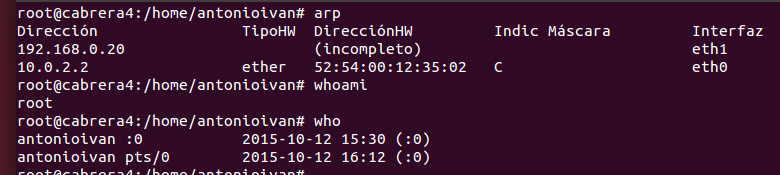

#Servidor LTSP y clientes ligeros

Un cliente liegro (thin client o slim client en inglés) es una computadora cliente o un software de cliente en una arquitectura de red cliente-servidor que depende primariamente del servidor central para las tareas de procesamiento, y se enfoca principalmente en transportar la entrada y la salida entre el usuario y el servidor remoto. En contraste, un cliente pesado realiza tanto procesamiento como sea posible y transmite solamente los datos para las comunicaciones y el almacenamiento al servidor.

#Preparando la máquina servidor

EL primer paso es crear una máquina servidor con SO Ubuntu 14.04 instalado.
Se necesitan dos interfaces de red, una en modo "adaptador puente" con
la ip 172.18.13.41 y otra en modo "red interna" con la ip 192.168.0.1.

Comprobamos la configuración actual de la máquina con los comandos siguientes:

	
	`ip a`

	`route -n`
 

	`hostname -a`
   

	`uname -a`
   

	`blkid`
   

Creamos 3 usuarios el comando `adduser`:

	`adduser cabrera1`

	`adduser cabrera2`

	`adduser cabrera3`

En ubuntu 14.04 el servidor SSH viene instalado por defecto pero si no fuese el caso usaríamos el comando

	`apt-get install openssh-server`
    
Editamos el archivo /etc/ssh/sshd_config y comentamos la siguiente línea:

Creamos la imagen del SO a partir del sistema real. Normalmente se crea de 64 bits si se usan sistemas de 64 bits, pero como me dio problemas opté por crear una imagen de 32 bits:

	`ltsp-build-client --arch i386`
    
#Preparando la máquina cliente
    
Una vez creada la imagen del SO, creamos una máquina cliente sin disco duro y sin lector de CD, sólo deberá tener
disquetera y tarjeta de red en modo "red interna".

Con el servidor iniciado, iniciamos el cliente y pulsamos F12 nada más arrancar la máquina y pulsamos L para cargar el SO
desde la red.

Entramos al SO con cada uno de los usuarios creados anteriormente.

Y por último, después de haber entrado con los 3 usuarios creados anteriormente, en el servidor ejecutamos los siguientes comandos en el terminal:

	`arp`
	`whoamin`
	`who`

[Demostración del cliente ligero y servidor LTSP funcionando](https://www.youtube.com/watch?v=I-EAJuwum1Y)

