NFS (Network File System)

NFS es una forma de crear recursos en red para compartir con sistemas heterogéneos.

#1. SO Windows
Para esta parte vamos a necesitar 2 máquinas:
* MV Windows 2008 Server (Enterprise) como nuestro servidor NFS.
    * Como nombre de esta máquina usar "primer-apellido-alumno+XX+WS".
    * IP estática 172.18.XX.22
    * Grupo de trabajo AULA108
* MV Windows (Enterprise) como nuestro cliente NFS.
    * Como nombre de esta máquina usar "primer-apellido-alumno+XX+WC".
    * IP estática 172.18.XX.12
    * Grupo de trabajo AULA108
    
> Donde XX es el número de PC de la máquina real de cada uno. 
Para averiguar XX se ejecuta en la máquina real, `ip a` o `ifconfig` o `if a s`, 
si muestra IP 172.16.8.30 entonces XX=30.

##1.1 Servidor NFS Windows

Instalación del servicio NFS en Windows 2008 Server
* Agregar rol `Servidor de Archivos`.
* Marcar `Servicio para NFS`.

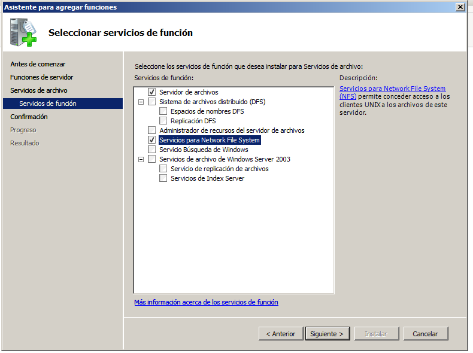
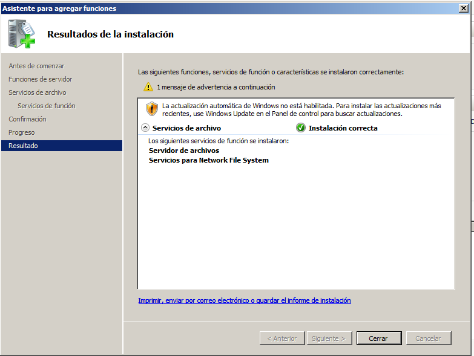

Configurar el servidor NFS de la siguiente forma:

* Crear la carpeta `c:\export\public`. Picar en la carpeta `botón derecho 
propiedades -> Compartir NFS`, y configurarla para que sea accesible desde 
la red en modo lectura/escritura con NFS

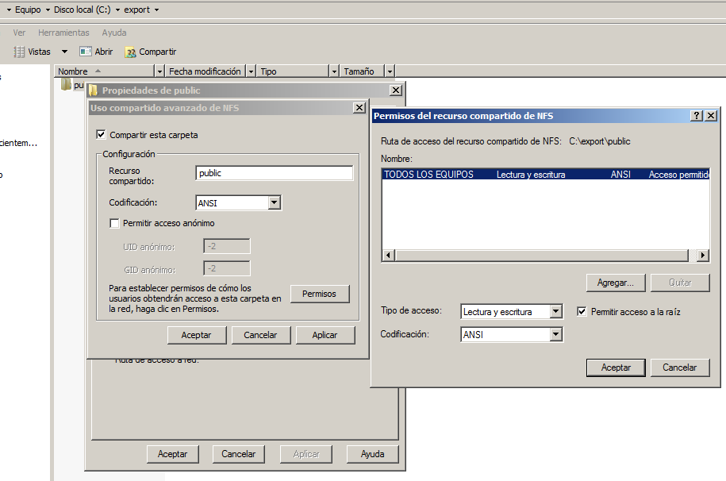

* Crear la carpeta `c:\export\private`. Picar en la carpeta `botón derecho 
propiedades -> Compartir NFS`, y configurarla para que sea accesible desde la red 
sólo en modo sólo lectura.

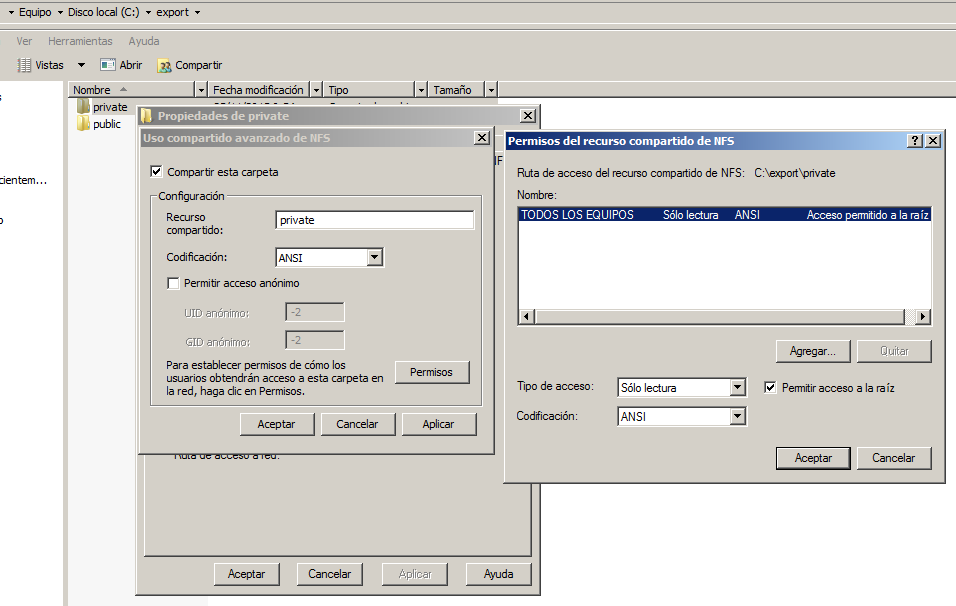

* Ejecutamos el comando `showmount -e ip-del-servidor`, para comprobar los recursos compartidos.

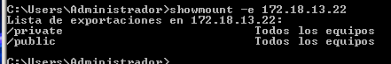

##1.2 Cliente NFS

Las últimas versiones de Windows permiten trabajar con directorios de red NFS nativos de sistemas UNIX. 
En esta sección veremos como montar y desmontar estos directorios bajo un entorno de Windows 7 
Enterprise (Las versiones home y starter no tienen soporte para NFS).

**Instalar el soporte cliente NFS bajo Windows**
* En primer lugar vamos a instalar el componente cliente NFS para Windows. 
Para ello vamos a `Panel de Control -> Programas -> Activar o desactivar características de Windows`.

* Nos desplazamos por el menú hasta localizar Servicios para NFS y dentro de este, Cliente NFS. 
* Marcamos ambos y le damos a Aceptar.
* En unos instantes tendremos el soporte habilitado.

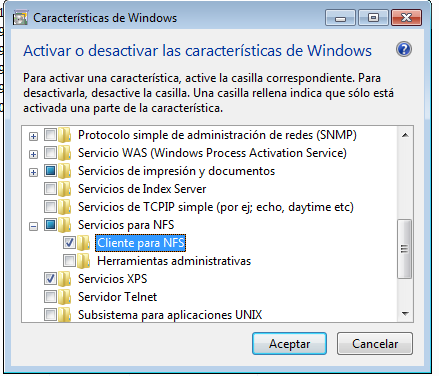

Iniciar el servicio cliente NFS.

* Para iniciar el servicio NFS en el cliente, abrimos una consola con permisos de Administrador.
* Ejecutamos el siguiente comando: `nfsadmin client start`

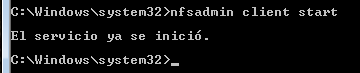

**Montando el recurso**

Ahora necesitamos montar el recurso remoto para poder trabajar con él.

* Esto no lo hacemos con Administrador, sino con nuestro usuario normal.
* Consultar desde el cliente los recursos que ofrece el servidor: `showmount -e ip-del-servidor`

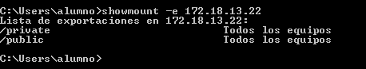

* Montar recurso remoto: `mount –o anon,nolock,r,casesensitive \\ip-del-servidor\Nombre-recurso-NFS *`
* Comprobar en el cliente los recursos montados: `net use`
* Comprobar desde el cliente: `showmount -a ip-del-servidor`

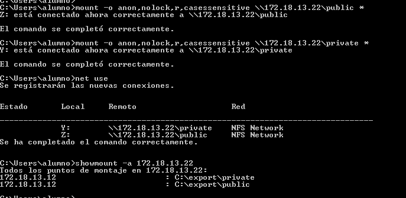

* En el servidor ejecutamos el comando `showmount -e ip-del-servidor`, para comprobar los recursos compartidos.

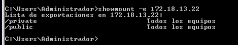

> **EXPLICACIÓN DE LOS PARÁMETROS**
>
> * anon: Acceso anónimo al directorio de red.
> * nolock: Deshabilita el bloqueo. Esta opción puede mejorar el rendimiento si sólo necesita leer archivos.
> * r: Sólo lectura. Para montar en modo lectura/escritura no usaremos este parámetro.
> * casesensitive: Fuerza la búsqueda de archivos con distinción de mayúsculas y minúsculas (similar a los clientes de NFS basados en UNIX).

* Hemos decidido asignar la letra de unidad de forma automática, así que si no hay otras unidades de red 
en el sistema nos asignará la Z.

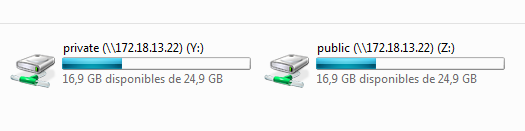

> Si hay problemas, comprobar que la configuración del cortafuegos del servidor permite accesos NFS.

> * Desde un cliente GNU/Linux hacemos `nmap IP-del-servidor -Pn`.
> * Debe aparecer abierto el puerto del servicio NFS

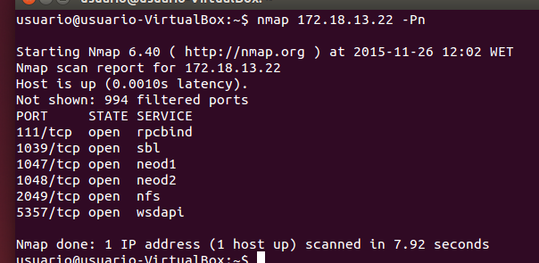

* Para desmontar la unidad simplemente escribimos en una consola: `umount z:`

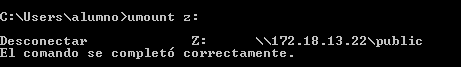

* En el servidor ejecutamos el comando `showmount -e ip-del-servidor`, para comprobar los recursos compartidos.

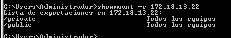