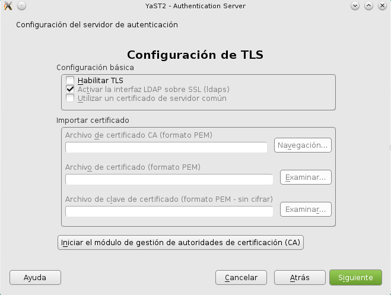
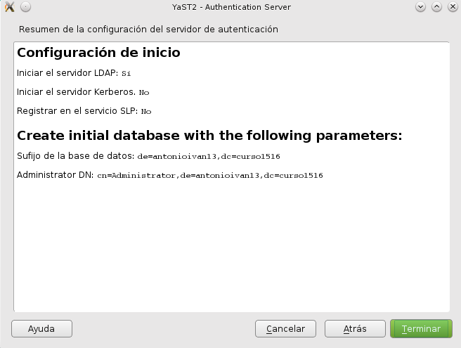

#Servidor LDAP - OpenSUSE

##1.1 Preparar la máquina
Comenzamos la instalación del servidor LDAP:
* Vamos a usar una MV para montar nuestro servidor LDAP con:
    * SO OpenSUSE 13.2
    * Instalar servidor SSH.
    * IP estática del servidor 172.18.XX.51 (Donde XX es su número de puesto).
    * Nombre equipo: `ldap-serverXX`
    * Dominio: `curso1516`
    * Además en `/etc/hosts` añadiremos:
```
127.0.0.2   ldap-serverXX.curso1516   ldap-serverXX
127.0.0.3   nombrealumnoXX.curso1516  nombrealumnoXX


```
* Capturar imagen de la salida de los siguientes comandos: `ip a`, `hostname -f`, `lsblk`, `blkid`


##1.2 Instalación del Servidor LDAP
* Procedemos a la instalación del módulo Yast para gestionar el servidor LDAP (`yast2-auth-server`).
En Yast aparecerá como `Authentication Server`.


* Apartir de aquí seguimos los pasos indicados en [servidor LDAP](https://es.opensuse.org/Configurar_LDAP_usando_YaST)
de la siguiente forma:
   * Ir a Yast -> Servidor de autenticación.


   * Tipo de servidor: autónomo


   * Configuración TLS: NO habilitar



   * Usar como DN el siguiente: `dc=nombredealumnoXX, dc=curso1516`. Donde XX es el número del puesto de cada uno.


   * NO habilitar kerberos.


   
Resumen de la configuración final:



* Una vez instalado, comprobar el servicio `systemctl  status slapd`. 


Comprobar también que el servicio se inicia automáticamente al reiniciar la máquina. 


* Continuar los pasos del enlace hasta el final, donde se puede comprobar el contenido
de la base de datos LDAP usando la herramienta `gq`. Esta herramienta es un browser LDAP.
* Comprobar que ya tenemos las unidades organizativas: `groups` y `people`.


##1.3. Crear usuarios y grupos en LDAP
Ahora vamos a [introducir datos de usuarios y grupos](https://es.opensuse.org/Ingreso_de_usuarios_y_grupos_en_LDAP_usando_YaST)
en el servidor LDAP siguiendo los pasos indicados en el enlace, pero personalizado la información de la siguiente
forma:

* Debemos instalar el paquete `yast2-auth-client`, que nos ayudará a configurar la máquina para autenticación.
En Yast aparecerá como `Authentication Client`.


> * El parámetro LDAP URI es un localizador del recurso de la base de datos LDAP. 
Veamos un ejemplo: `ldap://ldap-serverXX/dc=nombrealumnoXX,dc=curso1516`.


> * Las unidades organizativas: `groups` y `people`. Han sido creadas 
automáticamente por Yast en el paso anterior.


* Crear los grupos `jedis2` y `siths2` (Estos se crearán dentro de la `ou=groups`).
* Crear los usuarios `jedi21`, `jedi22`, `sith21`, `sith22` (Estos se crearán dentro de la `ou=people`).


* Comprobar mediante un browser LDAP (`gq`) la información que tenemos en la base de datos LDAP.


* Con el comando `ldapsearch -x -L -u -t "(uid=nombre-del-usuario)"`, podemos hacer una consulta en la base
de datos LDAP de la información del usuario.


##1.4. Autenticación

A partir de este paso hemos encontrado problemas para terminar la práctica, así que siguiendo las indicaciones del profesor, simplemente se comprueba que nos podemos "cambiar" desde el usuario root al usuario ldap con el comando:

	`su nombreusuario`
    


