#1. Introducción

Existen varias herramientas para realizar instalaciones desde un punto central, 
como Chef, Ansible, CFEngine, etc. En este ejemplo, vamos a usar Puppet.

Según Wikipedia, Puppet es una herramienta diseñada para administrar la configuración 
de sistemas Unix-like y de Microsoft Windows de forma declarativa. El usuario describe 
los recursos del sistema y sus estados, ya sea utilizando el lenguaje declarativo de 
Puppet o un DSL (lenguaje específico del dominio) de Ruby.

##1.1 Configuración

> En OpenSUSE podemos hacer configurar el equipo a través de `Yast`

> **IMPORTANTE**
> * Los nombres de máquinas, dominios, usuarios, etc., deben estar siempre en minúsculas.
> * No usar tildes, caracteres especiales (ñ, ü, etc.)

Vamos a usar 3 MV's con las siguientes configuraciones:
* MV1 - master: Dará las órdenes de instalación/configuración a los clientes.
    * SO GNU/Linux OpenSUSE 13.2
    * IP estática 172.18.XX.100
    * Enlace: 172.18.0.1
    * DNS: 8.8.4.4
    * Nombre del equipo: masterXX
    * Dominio = primer-apellido-del-alumno
    * Instalar OpenSSH-Server para acceso del profesor.
* MV1 - client1: recibe órdenes del master.
    * SO GNU/Linux OpenSUSE 13.2
    * IP estática 172.18.XX.101
    * Enlace: 172.18.0.1
    * DNS: 8.8.4.4
    * Nombre del equipo: cli1aluXX
    * Dominio = primer-apellido-del-alumno
    * Instalar OpenSSH-Server para acceso del profesor.
* MV3 - client2: recibe órdenes del master.
    * SO Windows 7. Este SO debe haber sido instalado por cada alumno. 
    NO clonar de un compañero y/o profesor.
    * IP estática 172.18.XX.102
    * Enlace: 172.18.0.1
    * DNS: 8.8.4.4
    * Nombre Netbios: cli2aluXX
    * Nombre del equipo: cli2aluXX
    * Grupo de trabajo = AULA108
    * Instalar ServidorSSH para acceso del profesor.
* Cada MV debe tener configurada en su `/etc/hosts` al resto. Para poder hacer `ping`
entre ellas usando los nombres. Con esto obtenemos resolución de nombres para nuestras
propias MV's sin tener un servidor DNS. 

>
> El fichero `hosts` de las máquinas debe tener un contenido similar a:
>
>     127.0.0.1       localhost
>     127.0.0.2       master30.vargas    master30
>     172.18.30.100   master30.vargas    master30
>     172.18.30.101   cli1alu30.vargas   cli1alu30
>     172.18.30.102   cli2alu30.vargas   cli2alu30


##1.2 Comprobacion de las configuraciones

En GNU/Linux, para comprobar que las configuraciones son correctas hacemos:

```
    date
    ip a
    route -n
    host www.google.es
    hostname -a
    hostname -f
    hostname -d
    ping masterXX
    ping masterXX.primer-apellido-del-alumno
    ping cli1aluXX
    ping cli1aluXX.primer-apellido-del-alumno
    ping cli2aluXX
    ping cli2aluXX.primer-apellido-del-alumno   
```

En Windows comprobamos con:

```
    date
    ipconfig
    route /PRINT
    nslookup www.google.es
    ping masterXX
    ping masterXX.primer-apellido-del-alumno
    ping cli1aluXX
    ping cli1aluXX.primer-apellido-del-alumno
    ping cli2aluXX
    ping cli2aluXX.primer-apellido-del-alumno   
```

> **IMPORTANTE**: Comprobar que todas las máquinas tienen la fecha/hora correcta.

Información del Master

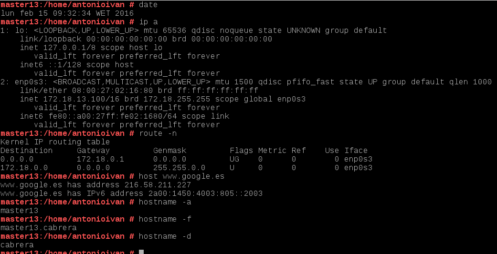

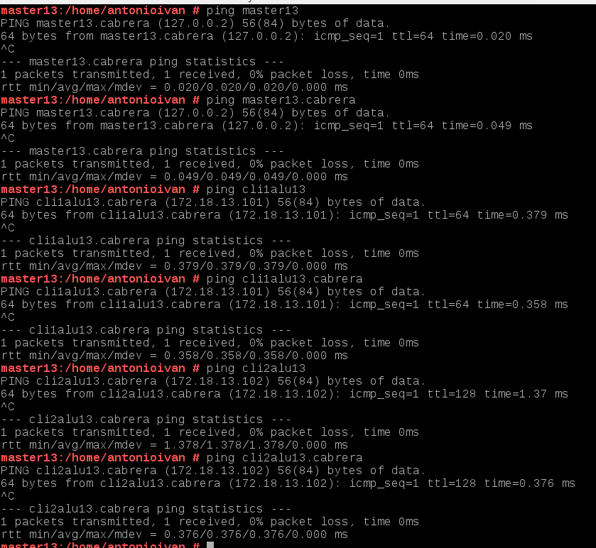

Información del cliente 1

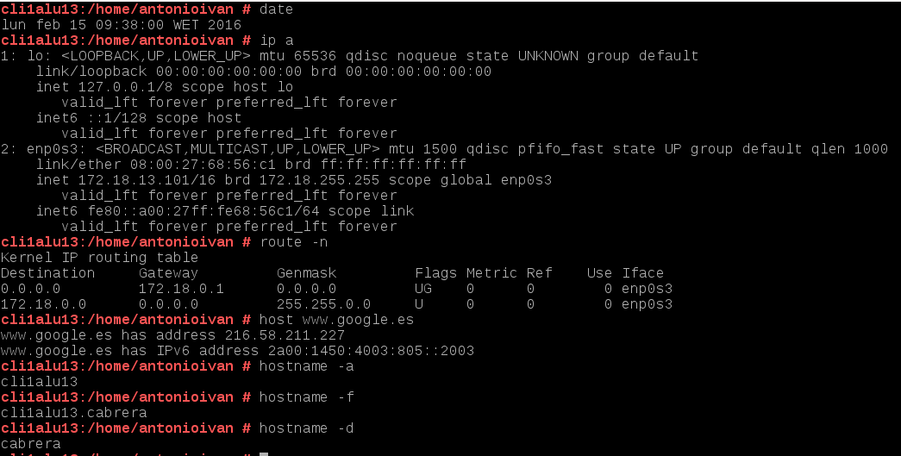

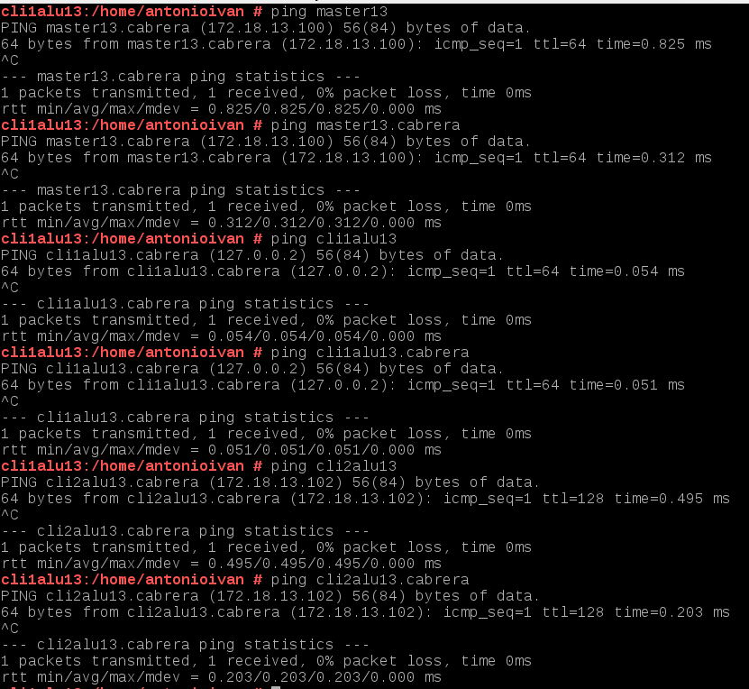

Información del cliente 2

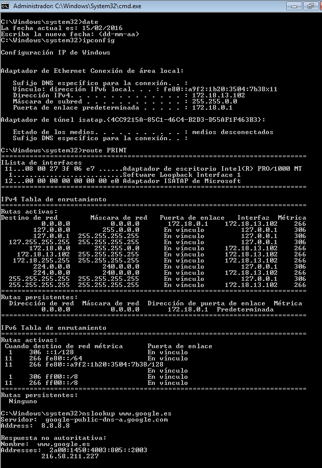

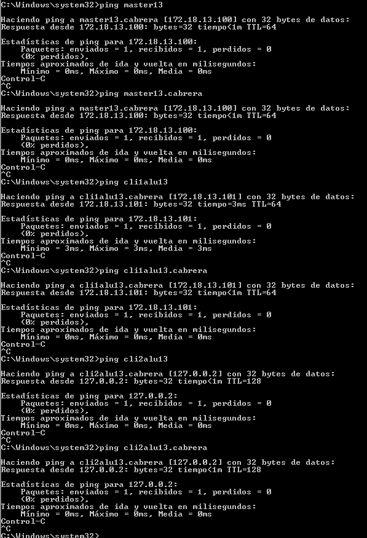

##1.3 Veamos un ejemplo

*Esto NO es obligatorio hacerlo. Sólo es un ejemplo.*

Vamos a ver un ejemplo de cómo usar `puppet` manualmente. Esto nos puede 
ayudar a comprender cómo es la sintaxis de la herramienta.

Al instalar el servidor Puppet en la máquina master, también tenemos instalado el Agente puppet.
Vamos a preguntar a puppet para ver cómo responde:
* sobre el paquete `tree` instalado en el sistema.
* sobre el usuario `yoda` creado en el sistema, y 
* sobre la carpeta `/home/yoda/endor` que ya existe en el sistema.

Vamos a averiguar la configuración que lee puppet de estos recursos, y guardamos los datos
obtenidos de puppet en el fichero de prueba `yoda.pp`. Para ello ejecutamos los comandos siguientes:

    puppet resource package tree > yoda.pp
    puppet resource user yoda >> yoda.pp
    puppet resource file /home/yoda/endor >> yoda.pp

El contenido del fichero `yoda.pp` debe ser parecido a:

```
package { 'tree':
  ensure => 'present',
}

user { 'yoda':
  ensure => 'present',
  home => '/home/yoda',
  password => '$6$G09ynAifi7mX$6pag6BIvQWT6iLa8fjQx20nEev3PabB6HdbqBX37oXrmP6y0',
  shell => '/bin/bash',
}

file { '/home/yoda/endor/':
  ensure => 'directory',
  group => '100',
  mode => '755',
  owner => '1001',
  type => 'directory',
}
```

Si nos lleváramos el fichero `yoda.pp` a otro PC con el Agente puppet instalado, 
podemos forzar a que se creen estos cambios con el comando: `puppet apply yoda.pp`

#2. Primera versión del fichero pp

* Instalamos Puppet Master en la MV masterXX: `zypper install puppet-server puppet puppet-vim`.

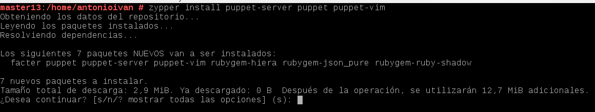

* `systemctl status puppetmaster`: Consultar el estado del servicio.

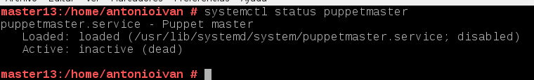

* `systemctl enable puppetmaster`: Permitir que el servicio se inicie automáticamente en el inicio de la máquina.

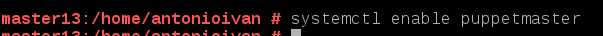

* `systemctl start puppetmaster`: Iniciar el servicio. En este momento debería haberse creado el directorio `/etc/puppet/manifests`.


* `systemctl status puppetmaster`: Consultar el estado del servicio.

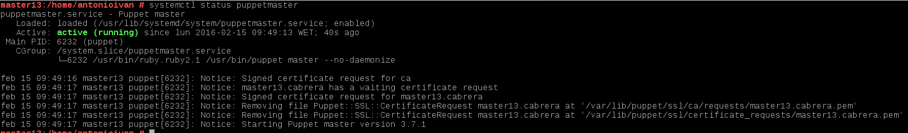

* Preparamos los ficheros/directorios en el master:
```
    mkdir /etc/puppet/files
    mkdir /etc/puppet/manifests
    mkdir /etc/puppet/manifests/classes
    touch /etc/puppet/files/readme.txt
    touch /etc/puppet/manifests/site.pp
    touch /etc/puppet/manifests/classes/hostlinux1.pp
```

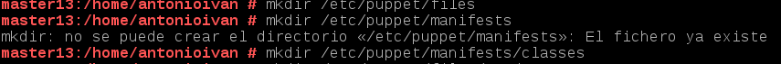

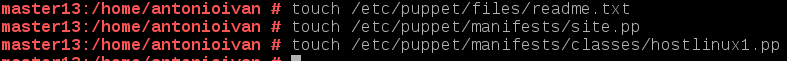


##2.1 /etc/puppet/files/readme.txt

* Contenido para readme.txt:

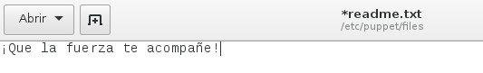

>Los ficheros que se guardan en `/etc/puppet/files` se pueden 
descargar por el resto de máquinas puppet.
>
> Ejemplo de configuración puppet para descargar fichero:
> ```
> file {  '/opt/readme.txt' :
>         source => 'puppet:///files/readme.txt', 
> }
> ```

##2.2 /etc/puppet/manifests/site.pp

* `/etc/puppet/manifests/site.pp` es el fichero principal de configuración 
de órdenes para los agentes/nodos puppet.
* Contenido de nuestro `site.pp`:

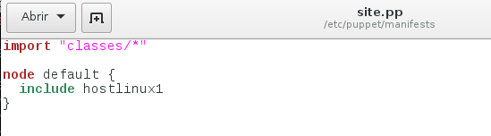

> Esta configuración significa:
> * Todos los ficheros de configuración del directorio classes se añadirán a este fichero.
> * Todos los nodos/clientes van a usar la configuración `hostlinux1`.

##2.3 /etc/puppet/manifests/classes/hostlinux1.pp

Como podemos tener muchas configuraciones, vamos a separarlas en distintos ficheros para
organizarnos mejor, y las vamos a guardar en la ruta `/etc/puppet/manifests/classes`

*Vamos a crear una primera configuración para máquina estándar GNU/Linux.
* Contenido para `/etc/puppet/manifiests/classes/hostlinux1.pp`:

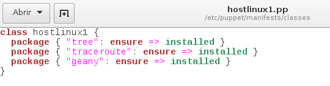

>**OJO**: La ruta del fichero es `/etc/puppet/manifests/classes/hostlinux1.pp`.

* Comprobar que tenemos los permisos adecuados en la ruta `/var/lib/puppet`.

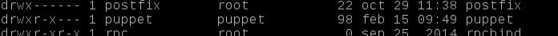

* Reiniciamos el servicio `systemctl restart puppetmaster`.

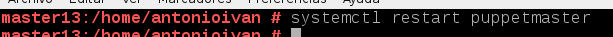

* Comprobamos que el servicio está en ejecución de forma correcta.

`systemctl status puppetmaster`

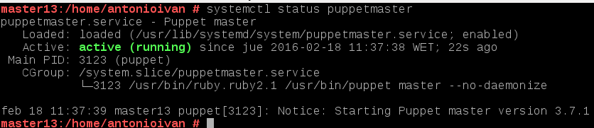

`netstat -ntap`

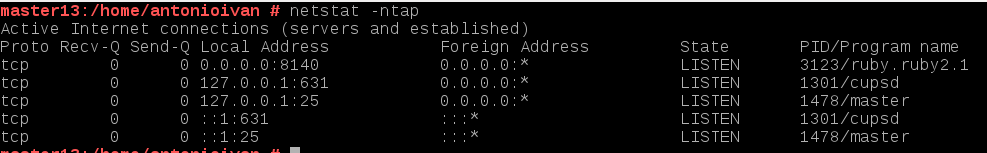

* Consultamos log por si hay errores: `tail /var/log/puppet/*.log`

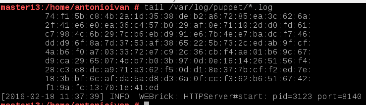

* Abrir el cortafuegos para el servicio.

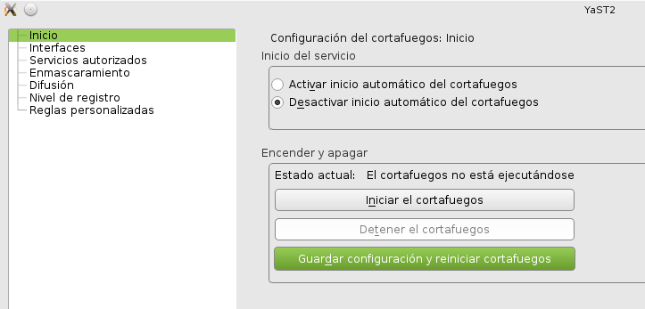

#3. Instalación y configuración del cliente1

Instalación:
* Instalamos Agente Puppet en el cliente: `zypper install puppet`

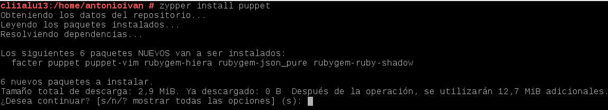

* El cliente puppet debe ser informado de quien será su master. 
Para ello, añadimos a `/etc/puppet/puppet.conf`:

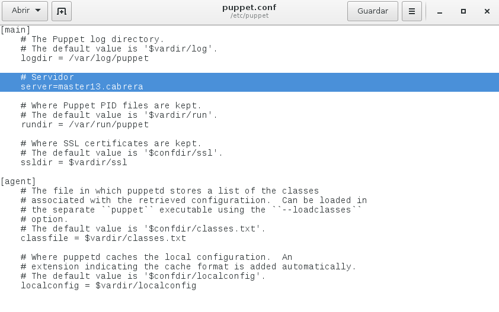

* Comprobar que tenemos los permisos adecuados en la ruta `/var/lib/puppet`.

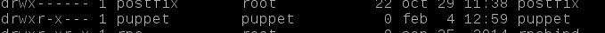

* `systemctl status puppet`: Ver el estado del servicio puppet.

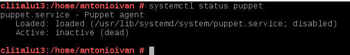

* `systemctl enable puppet`: Activar el servicio en cada reinicio de la máquina.


* `systemctl start puppet`: Iniciar el servicio puppet.


* `systemctl status puppet`: Ver el estado del servicio puppet.

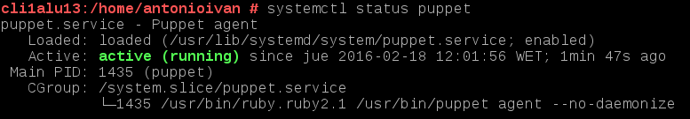

* `netstat -ntap`: Muestra los servicios conectados a cada puerto.

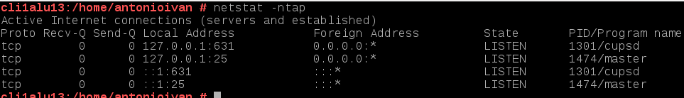

* Comprobamos los log del cliente: `tail /var/log/puppet/puppet.log`

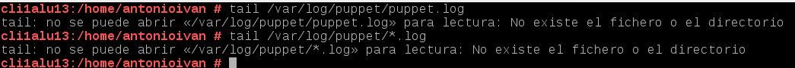

#4. Certificados

Antes de que el master acepte a cliente1 como cliente, se deben intercambiar los certificados entre 
ambas máquinas. Esto sólo hay que hacerlo una vez.

##4.1 Aceptar certificado

* Vamos al master y consultamos las peticiones pendiente de unión al master: `puppet cert list`

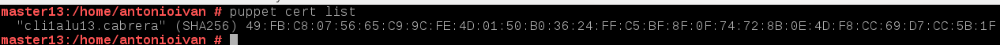

> **En caso de no aparecer el certificado en espera*
>
> * Si no aparece el certificado del cliente en la lista de espera del servidor, quizás
el cortafuegos del servidor y/o cliente, está impidiendo el acceso.
> * Volver a reiniciar el servicio en el cliente y comprobar su estado.

* Aceptar al nuevo cliente desde el master `puppet cert sign "nombre-máquina-cliente"`

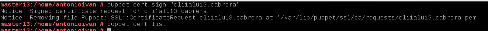

##4.2 Comprobación final

* Vamos a cliente1 y reiniciamos la máquina y/o el servicio Puppet.
* Comprobar que los cambios configurados en Puppet se han realizado.

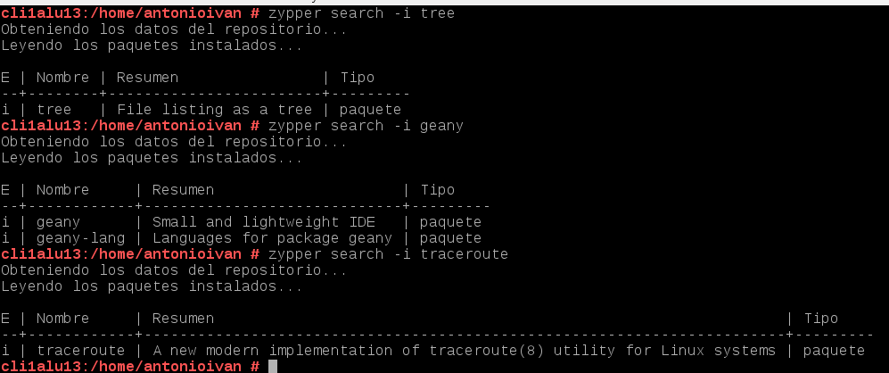

* En caso contrario, ejecutar comando para comprobar errores: 
    * `puppet agent --test`
    * `puppet agent --server master30.vargas --test`
* Para ver el detalle de los errores, podemos reiniciar el servicio puppet en el cliente, y 
consultar el archivo de log del cliente: `tail /var/log/puppet/puppet.log`.
* Puede ser que tengamos algún mensaje de error de configuración del fichero 
`/etc/puppet/manifests/site.pp del master`. En tal caso, ir a los ficheros del master 
y corregir los errores de sintáxis.

> **¿Cómo eliminar certificados?** (*Esto NO HAY QUE HACERLO*)
> 
> Sólo es información, para el caso que tengamos que eliminar los certificados. Cuando tenemos
problemas con los certificados, o los identificadores de las máquinas han cambiado suele ser
buena idea eliminar los certificados y volverlos a generar con la nueva información.
> 
> Si tenemos problemas con los certificados, y queremos eliminar los certificados actuales, podemos hacer lo siguiente:
> * `puppet cert revoke cli1alu30.vargas`: Lo ejecutamos en el master para revocar certificado del cliente.
> * `puppet cert clean  cli1alu30.vargas`: Lo ejecutamos en el master para eliminar ficheros del certificado del cliente.
> * `puppet cert print --all`: Muestra todos los certificados del servidor. No debe verse el del cliente que queremos eliminar.
> *  `rm -rf /var/lib/puppet/ssl`: Lo ejecutamos en el cliente para eliminar los certificados del cliente.
>
> Consultar [URL https://wiki.tegnix.com/wiki/Puppet](https://wiki.tegnix.com/wiki/Puppet), para más información.

#5. Segunda versión del fichero pp

Ya hemos probado una configuración sencilla en PuppetMaster. 
Ahora vamos a pasar a configurar algo más complejo.

* Contenido para `/etc/puppet/manifests/classes/hostlinux2.pp`:

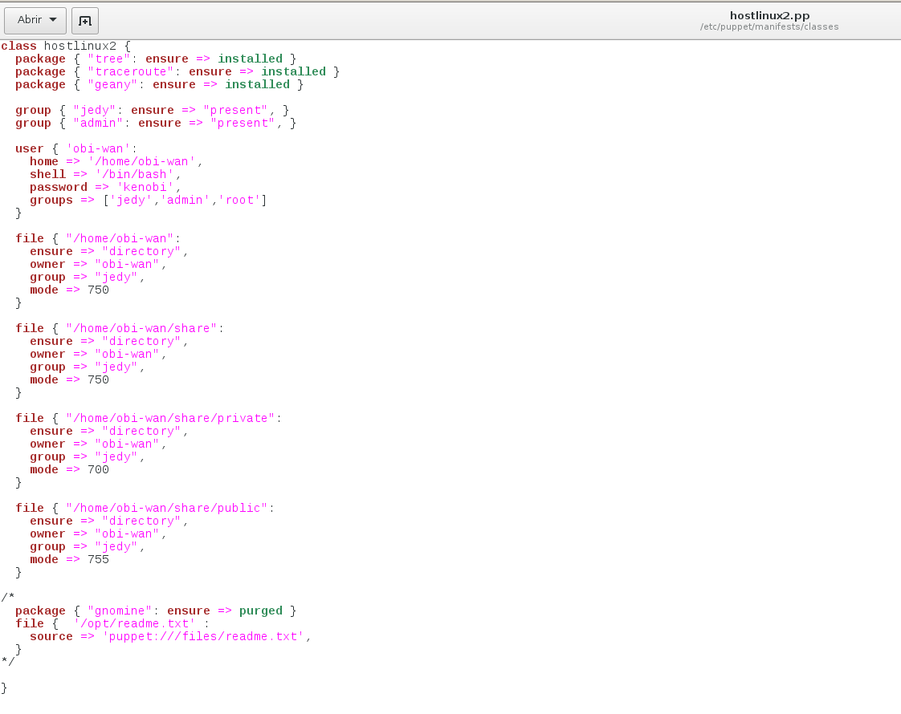

> Las órdenes anteriores de configuración de recursos puppet, tienen el significado siguiente:
>
> * **package**: indica paquetes que queremos que estén o no en el sistema.
> * **group**: creación o eliminación de grupos.
> * **user**: Creación o eliminación de usuarios.
> * **file**: directorios o ficheros para crear o descargar desde servidor.

* Modificar `/etc/puppet/manifests/site.pp` con:

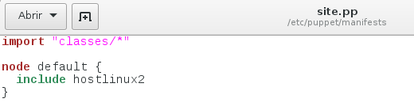

> Por defecto todos los nodos (máquinas clientes) van a coger la misma configuración.

Comprobamos los cambios en el cliente:

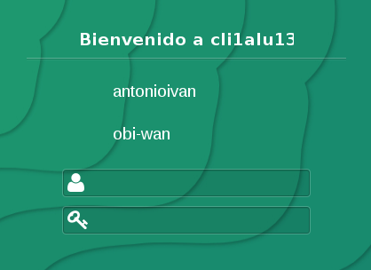

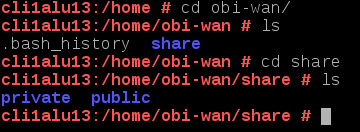

#6. Cliente puppet windows

Vamos a configurar Puppet para atender también a clientes Windows.

Enlace de interés: 
* [http://docs.puppetlabs.com/windows/writing.html](http://docs.puppetlabs.com/windows/writing.html)

##6.1 Modificaciones en el Master

* En el master vamos a crear una configuración puppet para las máquinas windows, dentro del fichero `/etc/puppet/manifests/classes/hostwindows3.pp`, con el siguiente contenido:

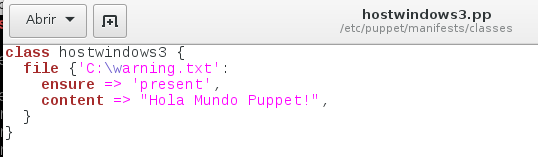

> De momento, esta configuración es muy básica. Al final la ampliaremos algo más.

* Ahora vamos a modificar el fichero `site.pp` del master, para que tenga en cuenta la configuración de clientes GNU/Linux y clientes Windows, de la siguiente forma:

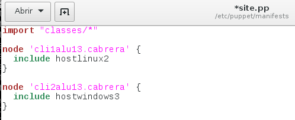

* Reiniciamos el servicio PuppetMaster.

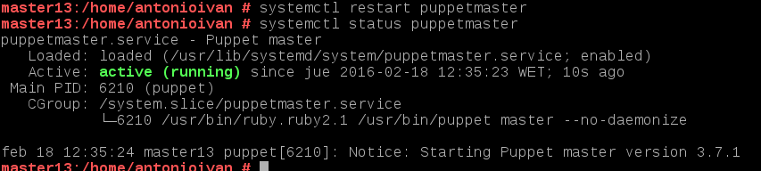

* Ejecutamos el comando `facter`, para ver la versión de Puppet que está usando el master.

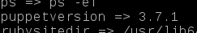

> Debemos instalar la misma versión de puppet en master y en los clientes

> **NOMBRES DE MÁQUINA**
> * El master GNU/Linux del ejemplo se llama `master30.vargas`
> * El cliente1 GNU/Linux del ejemplo se llama `cli1alu30.vargas`
> * El cliente2 Windows del ejemplo se llama `cli2alu30`

##6.2 Modificaciones en el cliente2

* Consultar URL:
    * [http://docs.puppetlabs.com/windows?/installing.html](http://docs.puppetlabs.com/windows?/installing.html)
    * [https://downloads.puppetlabs.com/windows/](https://downloads.puppetlabs.com/windows/)
* Ahora vamos a instalar AgentePuppet en Windows. Recordar que debemos instalar la misma versión en ambos equipos (Usar comando `facter` para ver la versión de puppet).

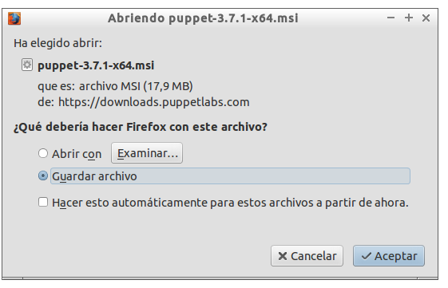

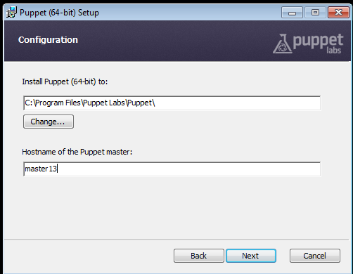

* Reiniciamos.
* Debemos aceptar el certificado en el master para este nuevo cliente. Consultar apartado 4.

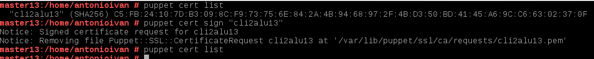


> *Consejo/sugerencia de Héctor Pedraza*:	
>
> Si tenemos problemas con el certificado de la máquina windows cliente tenemos que seguir 
los siguientes pasos para eliminar cualquier rastro de los mismos y poder reintentar la comunicación:
> * Borrar en el maestro el certificado correspondiente a esa máquina `puppet cert clean nombre-netbios-cliente`.
> * Desinstalar el agente puppet en windows.
> * Borrar las carpetas de datos del puppet, ya que no se borran en la desinstalación. Las carpetas son: 
>     * `C:\ProgramData\PuppetLabs` y 
>     * `C:\Users\usuario\.puppet`.
> * Después reinstalamos y volvemos a probar.
>
> Si seguimos teniendo problemas para unir/conectar el cliente windows con el puppetmaster, porque
no se realice el intercambio de certificados... podemos:
> * Repetir las recomendaciones anteriores para limpiar los datos, poner un nombre nuevo y diferente
a la máquina Windows e intentarlo de nuevo.
> * o usar una máquina Windows nueva (limpia de las acciones anteriores).

> Con los comandos siguentes podremos hacernos una idea de como terminar de configurar 
el fichero puppet del master para la máquina Windows.

* Iniciar consola puppet como administrador y probar los comandos:
    * `puppet agent --configprint server`, debe mostrar el nombre del servidor puppet.

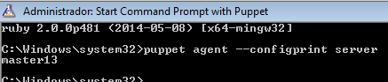

    * `puppet agent --server master30.vargas --test`: Comprobar el estado del agente puppet.

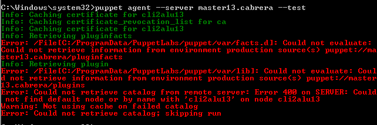

    * `puppet agent -t --debug --verbose`: Comprobar el estado del agente puppet.


    * `facter`: Para consultar datos de la máquina windows, como por ejemplo la versión de puppet del cliente.

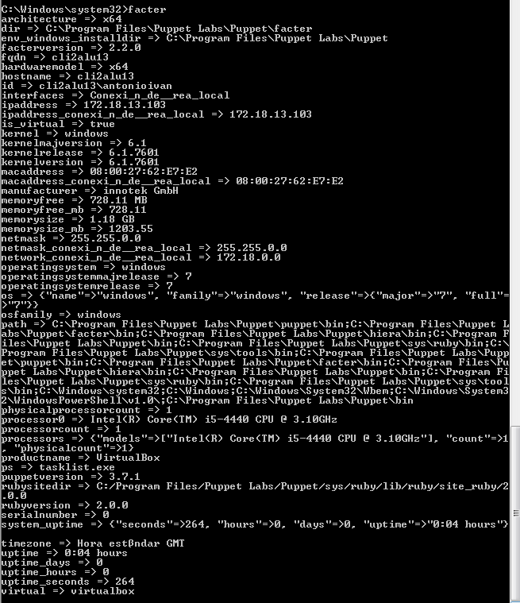

    * `puppet resource user nombre-alumno1`: Para ver la configuración puppet del usuario.

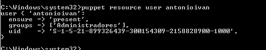

    * `puppet resource file c:\Users`: Para var la configuración puppet de la carpeta.

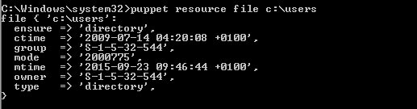


* Configuración en el master del fichero `/etc/puppet/manifests/classes/hostwindows3.pp` 
para el cliente Windows:

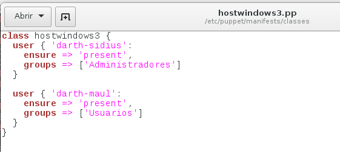

Reiniciamos y comprobamos que se han creado los dos nuevos usuarios:


* Crear un nuevo fichero de configuración para la máquina cliente Windows.

Nombrar el fichero con `/etc/puppet/manifests/classes/hostwindows4.pp`.

Incluir configuraciones elegidas por el alumno.

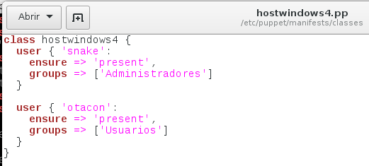

También tenemos que modificar el archivo site.pp:

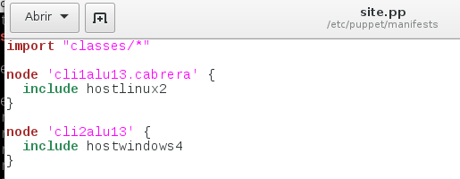

Y después de reiniciar comprobamos que tenemos dos usuarios más:


