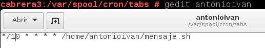
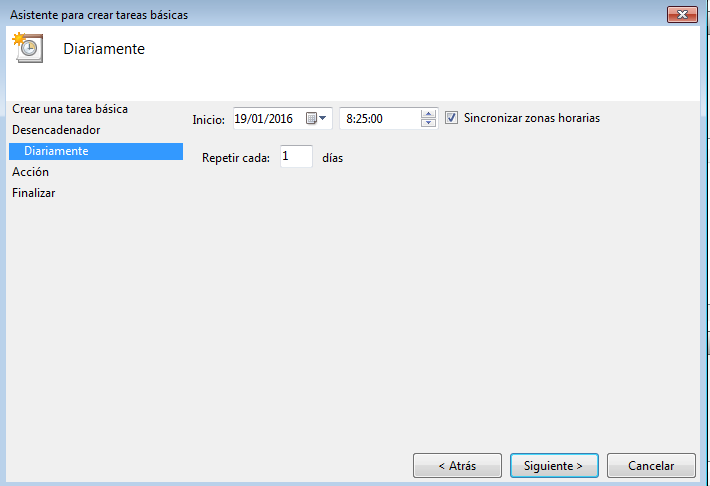
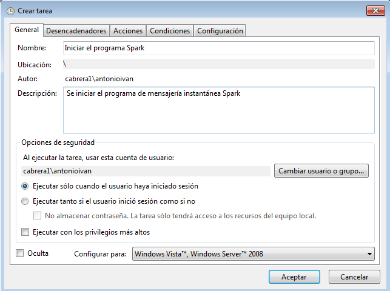

#Tareas programadas

Vamos a realizar tres tipos de tareas programadas: diferida, periódica y asíncrona.
Se llevarán a cabo en los sistemas operativos OpenSUSE y Windows7.

#1. SO OpenSUSE

##1.1 Configuración de la máquina

Configurar el equipo GNU/Linux OpenSUSE 13.2 con:
* IP: 172.18.XX.51 (Donde XX corresponde al nº de cada puesto).
* Máscara de red: 255.255.0.0
* Gateway: 172.18.0.1
* Servidor DNS: 8.8.4.4
* Nombre de equipo: primer-apellido-del-alumno+3. Ejemplo VARGAS3
* Nombre de dominio: segundo-apellido-del-alumno.
* Tarjeta de red VBox en modo puente.

Además también:
* Instalar openssh-server para que el profesor pueda acceder de forma remota.
* Asegurarse de que el nombre de host está correctamente en el fichero `/etc/hosts`.
Para que el comando `hostname` funcione bien.

Capturar imágen de la configuración del equipo:

    uname -a
   
    hostname -a
   
    hostname -d
   
    ip a
   
    route -n
   
    blkid
   

##1.2 Tarea diferida

Vamos a programar una tarea diferida con el comando at y el comando shutdown que reiniciará el equipo.

Primero usamos el comanto at para un momento concreto (en el ejemplo para dentro de un minuto). Luego se ledan las instrucciones a at para que ejecute los comandos solicitados, en este caso shutdown. En este caso el equipo se reiniciará en 1 minuto.
   

> * Si el servicio `atd` (responsable de la ejecución de los comandos at) no estuviera
en ejecución en OpenSUSE, iremos a `Yast -> Servicios` y lo iniciamos.

##1.3 Tarea periódica

Programaremos una tarea que muestre periódicamente en pantalla un mensaje.

Primero instalamos cron si no se encuentra en el equipo.

Creamos un script llamado mensaje.sh en el directorio que queramos, en este caso el home de nuestro usuario.

Luego con el comando `crontab -e` se nos abre una ventana en la que podemos editar el archivo que utilizará crontab para las tareas programadas de nuestro usuario. No es necesario utilizar el usuario root en este caso. Como se puede apreciar en la imagen, le estamos indicando a crontab que ejecute el script mensaje.sh cada diez minutos.

Por último, sólo queda comprobar que la tarea se ejecuta correctamente.

##1.4 Tarea asíncrona

Vamos a programar una tarea asíncrona para realizar una copia de backup.
Podemos usar el comando `tar` dentro de un script para realizar la copia de los ficheros del usuario en una zona de backup.
    * Directorio de datos `/home/nombre-alumno1`.
    * Directorio para guardar el backup `/var/backup-XX/nombre-alumno1`.

> Para definir una tarea asíncrona ponemos el script de ejecución en alguno 
de los directorios siguientes:
> * /etc/cron.hourly
> * /etc/cron.daily
> * /etc/cron.weekly
> * /etc/cron.monthly

En este caso hemos creado un script de copia de seguridad que hemos movido a /etc/cron.hourly.

Si todo va bien, debemos comprobar que en el directorio del backup aparecen los archivos de copia de seguridad y que además se actualizan cada hora. Como se trata de una tarea asíncrona, no se ejecuta siempre a la misma hora, pero sí cada hora que estemos usando el ordenador. En el ejemplo se aprecia que se ha creado la copia de seguridad a las 21:45

    
#2. Windows7

##2.1 Configuración de la máquina

Configurar máquina *Windows 7 Professional* con:
* IP: 172.18.XX.11 (Donde XX corresponde al nº de cada puesto).
* Nombre de equipo: primer-apellido-del-alumno+1. Por ejemplo: VARGAS1
* Máscara de red: 255.255.0.0
* Gateway: 172.18.0.1
* Servidor DNS: 8.8.4.4
* Grupo de trabajo: AULA108
* Tarjeta de red VBox en modo puente.

Configuración de red.

Nombre de equipo y grupo de trabajo.

##2.2 Tarea diferida

Vamos a programar el apagado del equipo con el comando shutdown. En el ejemplo programaos el apagado para dentro de una hora. ya que el tiempo está expresado en segundos.

Comprobamos que la tarea se realizará correctamente con el mensaje que a continuación aparecerá en la barra de tareas.

##2.3 Tarea periódica

Vamos a programar una tarea periódica para mostrar un mensaje en pantalla.

Encontramos el planificador de tareas en Panel de control -> Herramientas administrativas -> Programador de tareas. Para mostrar un mensaje en pantalla nos basta con crear una tarea básica.

Se ejecutará diariamente.

A una hora concreta.

La tarea será de mostrar un mensaje en pantalla.

Indicamos el título y contenido del mensaje.

Finalizamos la configuración de la tarea.

Por último comprobamos que se ejecuta corectamente a la hora que hemos puesto.

##2.4 Tarea asíncrona

Vamos a programar una tarea asíncrona para realizar una copia de backup iniciar un determinado programa con un determinado usuario. Esta vez tendremos que crear una tarea avanzada.

Descripción general de la tarea.

Escogemos el desencadenador, en este caso, al iniciar la sesión el usuario antonioivan.

Editamos la acción a realizar, en el ejemplo ejecutar el .exe de un determinado programa.

También podemos configurar algunas condiciones relacionadas con la red, enegría, etc.

Configuración adicional que también podremos modificar a nuestro gusto.

Por último, comprobamos que el programa se inicia al iniciar sesión con un determinado usuario y después de unos determinados minutos. Puede ser útil si queremos retrasar el inicio de un programa que ralentiza el inicio del equipo pero que queremos que se ejecute automáticamente al inicio.

#Observacioes

Esta actividad fue realizada en gran parte antes del cambio de enunciado de la actividad, por lo que casi todas las tareas no coinciden con las que actualmente pide el enunciado.