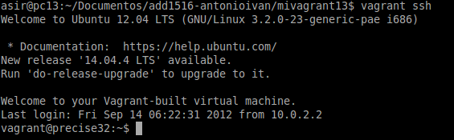
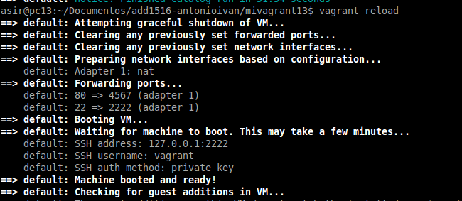

#1. Introducción

*Wikipedia*
```
    Vagrant es una herramienta para la creación y configuración de entornos 
    de desarrollo virtualizados.

    Originalmente se desarrolló para VirtualBox y sistemas de configuración tales 
    como Chef, Salt y Puppet. Sin embargo desde la versión 1.1 Vagrant es 
    capaz de trabajar con múltiples proveedores, como VMware, Amazon EC2, LXC, 
    DigitalOcean, etc.2

    Aunque Vagrant se ha desarrollado en Ruby se puede usar en multitud de 
    proyectos escritos en otros lenguajes.
```

*Autor*
```
    La información para desarrollar esta actividad ha sido extraída del 
    enlace anterior publicado por: Jonathan Wiesel, El 16/07/2013*
```

#2. Primeros pasos

##2.1 Instalar

> Para instalar vagrant hay varias formas (como todos sabemos).

* Nosotros vamos a usar el paquete [Vagrant-deb](http://172.20.1.2/~david/vagrant_1.7.2_x86_64.deb) 
preparado para descargar del servidor Leela.

##2.2. Proyecto
* Crear un directorio para nuestro proyecto vagrant.
```
    mkdir mivagrantXX
    cd mivagrantXX
    vagrant init
```


##2.3 Imagen, caja o box
* Ahora necesitamos obtener una imagen(caja, box) de un sistema operativo. Por ejemplo:
```
vagrant box add micajaXX_ubuntu_precise32 http://files.vagrantup.com/precise32.box
```


* Podemos listar las cajas/imágenes disponibles actualmente en nuestro sistema con `vagrant box list`.
* Para usar una caja determinada en nuestro proyecto, modificamos el fichero `Vagrantfile` 
de la carpeta del proyecto.
* Cambiamos la línea `config.vm.box = "base"` por  `config.vm.box = "micajaXX_ubuntu_precise32"`.


##2.4 Iniciar la máquina

Vamos a iniciar la máquina virtual creada con Vagrant:
* `cd mivagrantXX`
* `vagrant up`: comando para iniciar una la instancia de la máquina.


* Podemos usar ssh para conectar con nuestra máquina virtual (`vagrant ssh`).

* Otros comandos de Vagrant:
    * `vagrant suspend`: Suspender la máquina.
    * `vagrant resume` : Volver a despertar la máquina.
    * `vagrant halt`: Apagarla la máquina.
    * `vagrant status`: Estado actual de la máquina.
    * `vagrant destroy`: Para eliminar completamente la máquina.


> Debemos tener en cuenta que tener el ambiente en modo **suspendido** consume espacio
 en disco debido a que el estado de la maquina virtual que suele almacenarse en RAM debe pasar a disco.

#3. Configuración

##3.1 Carpetas sincronizadas

> La carpeta del proyecto que contiene el `Vagrantfile` comparte los 
archivos entre el sistema anfitrión y el virtualizado, esto nos permite 
compartir archivos fácilmente entre los ambientes.

* Para identificar la carpeta compartida dentro del ambiente virtual,
lo que hacemos es:
```
    vagrant up
    vagrant ssh
    ls /vagrant
```


> Esto nos mostrará que efectivamente el directorio `/vagrant` dentro del ambiente 
virtual posee el mismo `Vagrantfile` que se encuentra en nuestro sistema anfitrión. 
>
> Cualquier archivo que coloquemos en este directorio será accesible desde cualquiera de los 2 extremos. 

##3.2 Redireccionamiento de los puertos

Uno de los casos más comunes cuando tenemos una máquina virtual es la 
situación que estamos trabajando con proyectos enfocados a la web, 
y para acceder a las páginas no es lo más cómodo tener que meternos 
por terminal al ambiente virtual y llamarlas desde ahí, aquí entra en 
juego el enrutamiento de puertos.

* Modificar el fichero `Vagrantfile`, de modo que el puerto 4567 del sistema anfitrión será enrutado al puerto 80 del ambiente virtualizado.

`config.vm.network :forwarded_port, host: 4567, guest: 80`


* Instalamos también apache en la MV.


* Luego iniciamos la MV (si ya se encuentra en ejecución lo podemos refrescar con `vagrant reload`)


* En nuestro sistema anfitrión nos dirigimos al explorador de internet, y colocamos: `http://127.0.0.1:4567`. En realidad estaremos accediendo  al puerto 80 de nuestro sistema virtualizado. 
 


##3.3 Otras configuraciones

A continuación se muestran ejemplos que NO hay que hacer. Sólo es información.

Enlace de interés: 
* [Tutorial Vagrant. ¿Qué es y cómo usarlo?](https://geekytheory.com/tutorial-vagrant-1-que-es-y-como-usarlo)

Ejemplo para configurar la red:
```
  config.vm.network "private_network", ip: "192.168.33.10"
```

Ejemplo para configurar las carpetas compartidas:
```
  config.vm.synced_folder "htdocs", "/var/www/html"
```

Ejemplo, configurar en Vagrantfile la conexión SSH de vagrant a nuestra máquina:
```
  config.ssh.username = 'root'
  config.ssh.password = 'vagrant'
  config.ssh.insert_key = 'true'
```

Ejemplo para configurar en Vagrantfile la ejecución remota de aplicaciones
gráficas instaladas en la máquina virtual, mediante SSH:
```
  config.ssh.forward_agent = true
  config.ssh.forward_x11 = true
```

#4.Suministro

##4.1 Suministro mediante script

Quizás el aspecto con mayor beneficios del enfoque que usa Vagrant 
es el uso de herramientas de suministro, el cual consiste en correr 
una receta o una serie de scripts durante el proceso de levantamiento 
del ambiente virtual que permite instalar y configurar un sin fin 
piezas de software, esto con el fin de que el ambiente previamente 
configurado y con todas las herramientas necesarias una vez haya sido levantado.

Por ahora suministremos al ambiente virtual con un pequeño script que 
instale Apache.

* Crear el script `install_apache.sh`, dentro del proyecto con el siguiente
contenido:


* Modificar Vagrantfile y agregar la siguiente línea a la configuración:
`config.vm.provision :shell, :path => "install_apache.sh"`


> * Esta instrucción le indica a Vagrant que debe usar la herramienta nativa shell 
para suministrar el ambiente virtual con el archivo `install_apache.sh`.
> * Si usamos los siguiente `config.vm.provision "shell", inline: '"echo "Hola"'`, ejecuta
directamente el comando especificado, sin usar script.

* Iniciamos la MV o `vagrant reload` si está en ejecución para que coja el cambio de la configuración.


> Podremos notar, al iniciar la máquina, que en los mensajes de salida se muestran
mensajes que indican cómo se va instalando el paquete de Apache que indicamos:


* Para verificar que efectivamente el servidor Apache ha sido instalado e iniciado, 
abrimos navegador en la máquina real con URL `http://127.0.0.1:4567`.


##4.2 Suministro mediante Puppet

Enlace de interés:
* [Crear un entorno de desarrollo con vagrant y puppet](http://developerlover.com/crear-un-entorno-de-desarrollo-con-vagrant-y-puppet/)
* friendsofvagrant.github.io -> Puppet Provisioning

Veamos imágenes de ejemplo suministradas por Aarón Gonźalez Díaz:

Vagrantfile configurado con puppet:


Fichero de configuración de puppet:


Comprobación de que el suministro mediante puppet está funcionando:




> Veamos otros ejemplo:
> ```
> Vagrant::Config.run do |config|
>   config.vm.provision :puppet do |puppet|
>     puppet.manifest_path = "manifests"
>     puppet.manifest_file = "apache2.pp"
>   end
> end
>```

> En el fichero `apache2.pp`, estarán las órdenes puppet para instalar y configurar 
el servicio web apache2.

#5. Otras cajas, nuestras cajas

Existen muchos repositorios para descargar cajas. Por ejemplo:
* [Vagrant Box List](http://www.vagrantbox.es)
* [HashiCorp's Atlas box catalog](https://atlas.hashicorp.com/boxes/search)

> Incluso podemos descargarnos cajas con Windows, GNU/Linux con entorno gráfico, BSD, etc.

Si estamos pensando en crear nuestra propia caja, entonces podemos seguir las
indicaciones del siguiente enlace:
* [¿Cómo crear una Base Box en Vagrant a partir de una máquina virtual](http://www.dbigcloud.com/virtualizacion/146-como-crear-un-vase-box-en-vagrant-a-partir-de-una-maquina-virtual.html)

**Preparación de la máquina virtual**

Crear el usuario Vagrant, para poder acceder a la máquina virtual por ssh, a este usuario debemos crear una relación de confianza  usando el siguiente Keypairs.


Aunque Vagrant no esta pensado para usar el usuario root, a veces nos es necesario por lo que debemos cambiar la password de root a "vagrant" (sin las comillas).


Conceder permisos al usuario vagrant para que pueda configurar la red, instalar software, montar carpetas compartidas... para ello debemos configurar visudo para que no nos solicite la password de root, cuando realicemos estas operación con el usuario vagrant. Editamos el archivo /etc/sudoers


Debemos asegurarnos que tenemos instalado las VirtualBox Guest Additions, para conseguir mejoras en el S.O o poder compartir carpetas con el anfitrión. 

NOTA: En mi caso ya estaba instalado en la máquina virtual por lo que no tuve que realizar este paso.

Como recomendación vamos a crear una nueva carpeta para este nuevo proyecto vagrant. Ejecutamos
`vagrant init` para crear el fichero de configuración nuevo.


A partir de una máquina virtual VirtualBox (`Ubuntu1404antonioivan`) vamos a crear la caja `package.box`.


Finalmente, añado la nueva caja creada por mí al repositorio de vagrant.


Editamos el Vagrantfile.


Levantamos la máquina.


A partir de aquí he encontrado problemas para loguearme con Vagrant. Da el siguiente error:


Ni siquiera he conseguido loguearme cambiando la configuración del Vagrantfile, seguido de ``vagrant reload``


Sin embargo, se ve que la máquina está funcionando perfectamente, falla el login desde Vagrant.


Desde Virtualbox he podido entrar perfectamente en el sistema.


